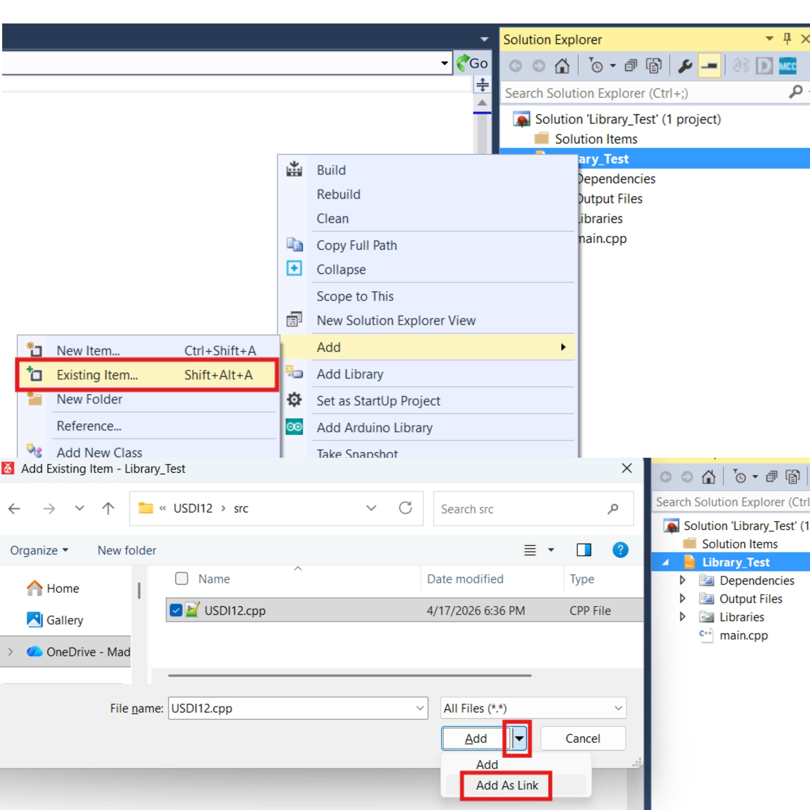
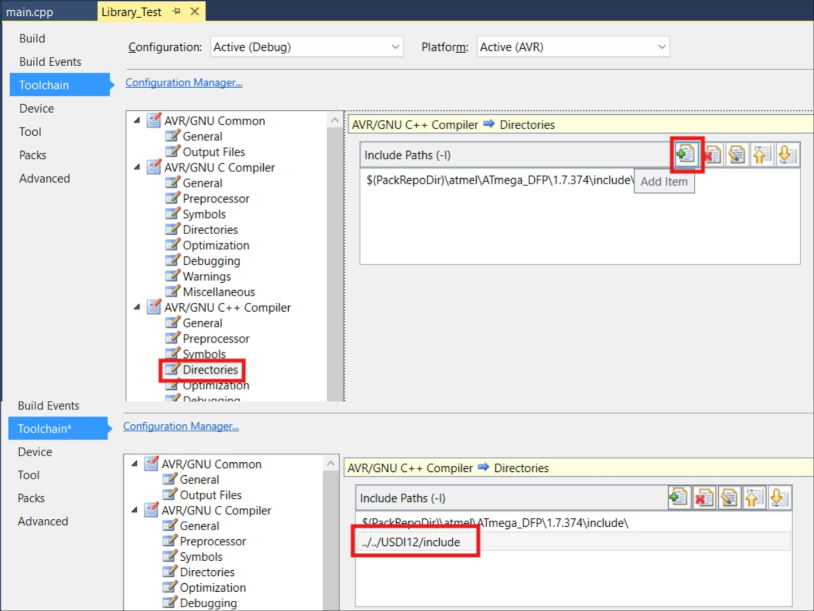

# Microchip Studio Notes

## How to Add the USDI-12 Library
This is the best way I have found to add the USDI-12 library to a Microchip Studio project.

### Add the USDI-12 Library Files:
First, place the USDI-12 library folder at the same level as your `MyProject.atsln` file. For example, place the USDI12 files like the following,

```
Project/
├── MyProject.atsln
├── MyProject/       ← Your project folder with source files
└── USDI12/          ← External USDI-12 "library" folder
    ├── src/
    │   └── USDI12.cpp
    └── include/
        ├── USDI12.hpp
        └── USDI12_HAL.hpp
```

### Add the USDI-12 Source File to Your Project:
In Microchip Studio, right-click on your project in the "Solution Explorer" and select "Add" → "Existing Item.". Then navigate to your `USDI12/src/` folder and select `USDI12.cpp` but **do not click** "Add" yet. Instead, click the dropdown arrow next to the "Add" button and select **"Add As Link"**. This will add the USDI-12 source file to your project as a link, so it references the original library location rather than copying it into your project directory.




### Add the USDI-12 Include Path:
Next, you need to tell the compiler where to find the USDI-12 header files. Right-click on your project and select "Properties". Then navigate to "Toolchain" → "AVR/GNU C++ Compiler" → "Directories". Add the path to your `USDI12/include/` folder. This will allow you to include the headers using `#include "USDI12.hpp"` or `#include "USDI12_HAL.hpp"`.



### Done!
Now you can include the USDI-12 headers in your source and use the library as part of your main project.